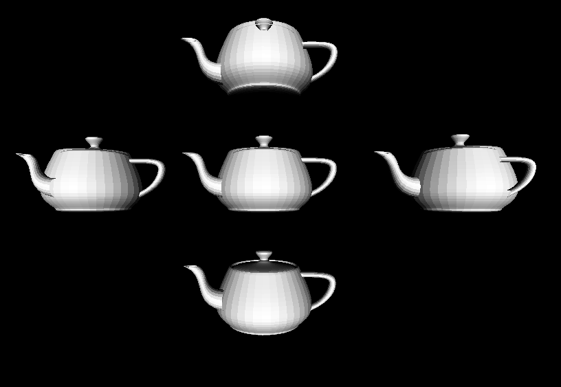

# rSimple3D-asm
A real-time software 3D-rasterizer in handwritten x86 assembly.



[Main repo (sr.ht)](https://sr.ht/~lasse/rSimple3D-asm/) - 
[Mirror repo (github)](https://github.com/Janbuller/rSimple3D-asm)

---

# How?
This project was written in intel-syntax (nasm-style) x86-64 assembly. The AMD64 sysv calling conventions were used for all the exported labels/functions. C-style header files have also been included for all the exported functions. These were originally made to help myself keep track of the function parameters when writing the assembly, but they should (hopefully) also allow the functions to be used within c-code, assuming I didn't misunderstand part of the calling conventions.

The rasterizer links with both the standard C library, as well as the standard c math library. The raylib library is also used for setting up a window and drawing colored 2D triangles to that window.

Some shortcuts have been taken to avoid spending too much time on this project (a notable one being the lack of any depth-buffering, painters algorithm, or any other similar technique).

# Why?
This entire project was made because I've been wanting to learn the basics of writing assembly code. I figured the best way to learn would be to actually build a project in assembly, so I decided to try my hand at making a simple software 3D-rasterizer.

# Building
This project is only intended to build on x86-64 systems that use the AMD64 sysv calling conventions (sorry windows users). There are a few dependencies, most notably being:

- `ld`
- `cc`
- `nasm`
- raylib
- libc

To compile, on most systems, just run the following commands:

```sh
$ git clone https://git.sr.ht/~lasse/rSimple3D-asm
$ cd rSimple3D-asm
$ make
```

The binary will then be located at `./build/rSimple3D`
